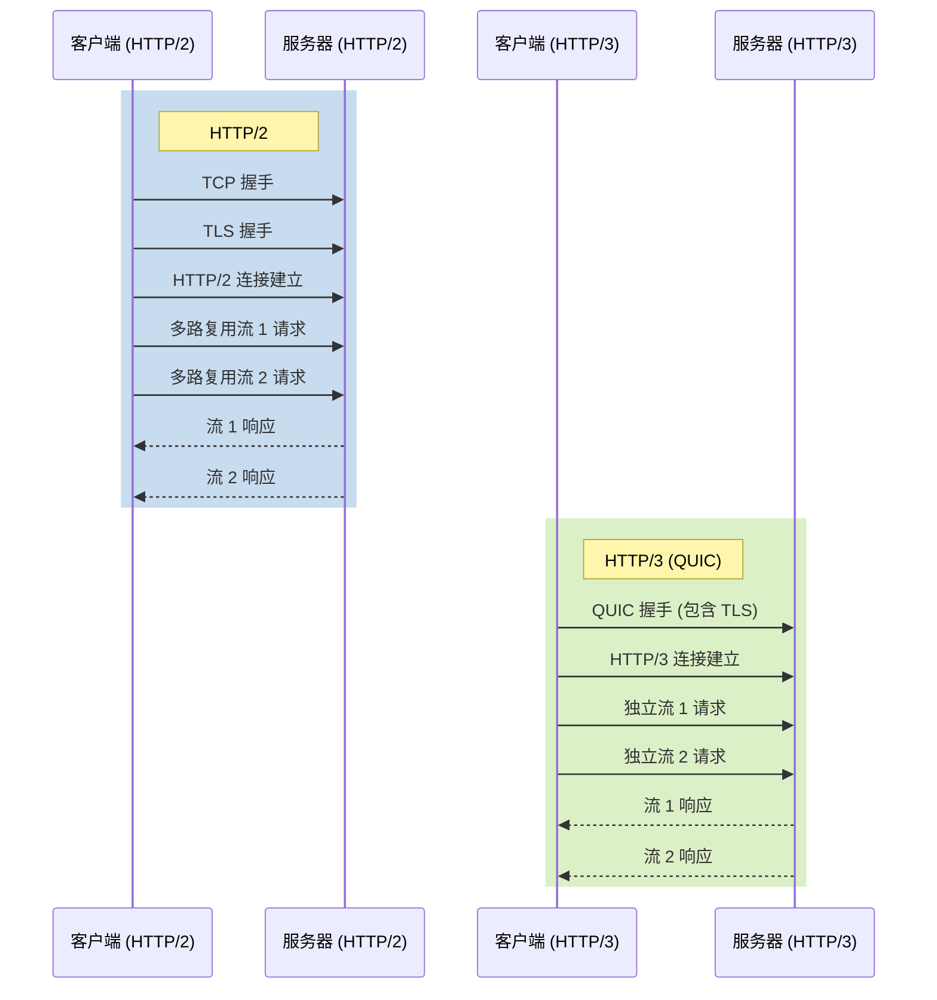
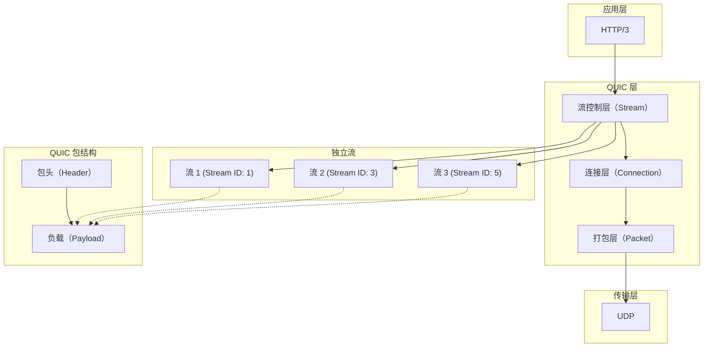

# HTTP/2 vs HTTP/3 交互协议比较

这个图表展示了 HTTP/2 和 HTTP/3 的主要交互差异：

1. 连接建立：

	1. HTTP/2 使用 TCP 作为传输层协议，需要先进行 TCP 握手，然后是 TLS 握手。
	2. HTTP/3 使用 QUIC 协议，它集成了传输层和加密层，因此只需要一次 QUIC 握手就可以建立安全连接。

2. 多路复用：

	1. HTTP/2 在单个 TCP 连接上使用多路复用来处理多个请求和响应。
	2. HTTP/3 使用 QUIC 的独立流，每个流都是相互独立的，避免了 HTTP/2 中的队头阻塞问题。

3. 协议栈：

	1. HTTP/2 构建在 TCP 之上，然后是 TLS，最后是 HTTP/2 协议。
	2. HTTP/3 直接构建在 QUIC 之上，QUIC 已经集成了传输和安全功能。

4. 性能：

	1. HTTP/3 通常可以更快地建立连接，因为它减少了握手的往返次数。
	2. 由于 QUIC 的独立流设计，HTTP/3 在处理数据包丢失时表现更好，不会影响其他流的传输。

5. 灵活性：

	1. HTTP/3 基于 UDP，这使得它在网络环境变化时（如移动设备切换网络）能够更快地恢复连接。

# QUIC 协议栈和独立流的实现原理

这个图表展示了 QUIC 协议栈和独立流的实现原理：

1. QUIC 协议栈：

	- 应用层：HTTP/3 构建在 QUIC 之上。
	- QUIC 层：
	
		- 流控制层（Stream）：管理独立的双向数据流。
		- 连接层（Connection）：处理连接建立、维护和安全性。
		- 打包层（Packet）：负责数据的分包和重组。
	- 传输层：QUIC 使用 UDP 作为底层传输协议。

2. 独立流的实现：

	- 每个流都有唯一的 Stream ID。
	- 流是双向的，客户端发起的流使用奇数 ID，服务器发起的流使用偶数 ID。
	- 流的数据被分割成多个 STREAM 帧，这些帧被封装在 QUIC 包中。

3. QUIC 包结构：
	
	- 包头（Header）：包含连接 ID 和包序号等信息。
	- 负载（Payload）：包含来自不同流的数据帧。

4. 独立流的工作原理：

	- 每个流都是逻辑上独立的数据通道。
	- 流的数据被分割成 STREAM 帧。
	- 多个流的 STREAM 帧可以在同一个 QUIC 包中混合传输。
	- 接收方根据 Stream ID 重组来自不同流的数据。

5. 流量控制和优先级：
	
	- 每个流都有自己的流量控制机制。
	- 可以为不同的流设置不同的优先级。
	
6. 错误隔离：
	
	- 一个流的错误通常不会影响其他流的传输。
	- 如果一个流出现问题，可以单独关闭该流而不影响整个连接。

7. 连接复用：

	- 多个流共享同一个 QUIC 连接，减少了建立新连接的开销。
	- 连接迁移：QUIC 连接可以在 IP 地址变化时保持活跃（例如，从 Wi-Fi 切换到移动数据）。

QUIC 的独立流设计允许在单个连接上实现真正的多路复用，每个流都可以独立地传输数据，而不会相互干扰。这种设计极大地提高了并发性能，减少了延迟，并提供了更好的网络适应性。

