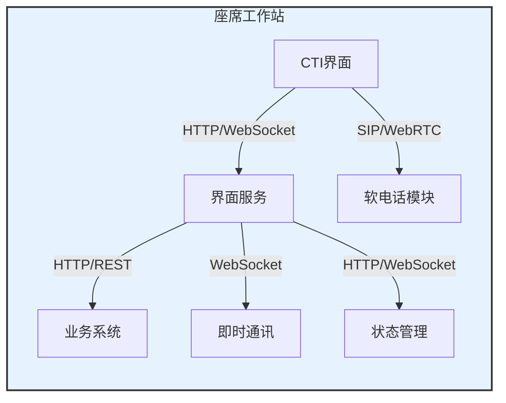
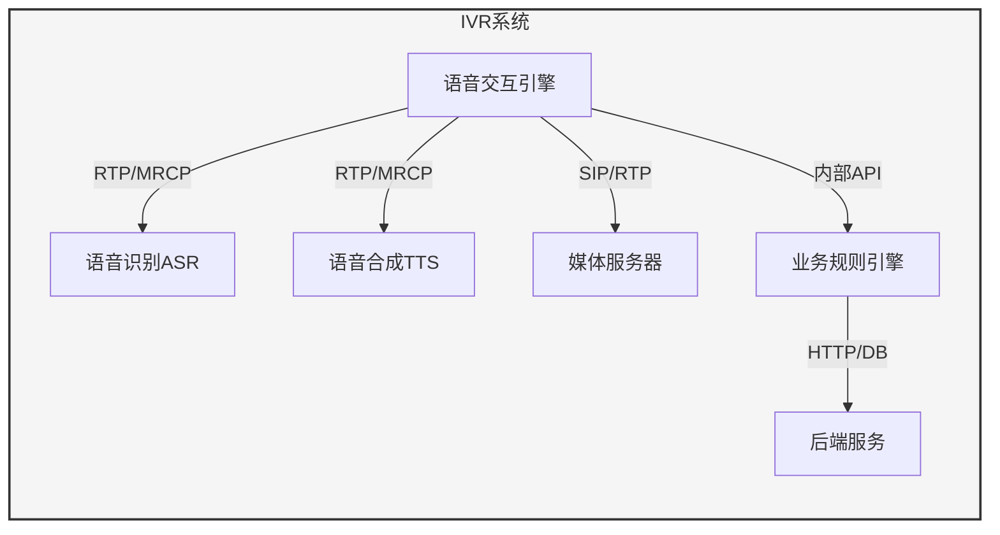
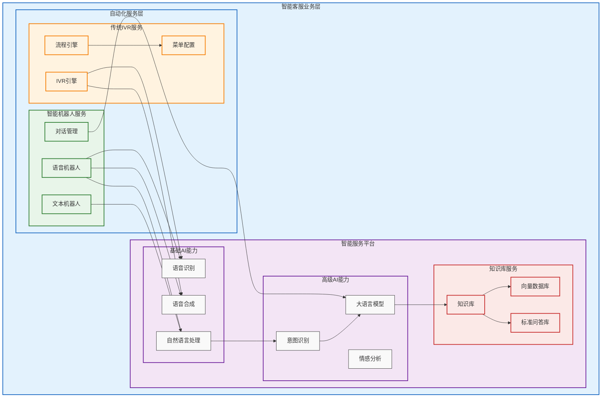
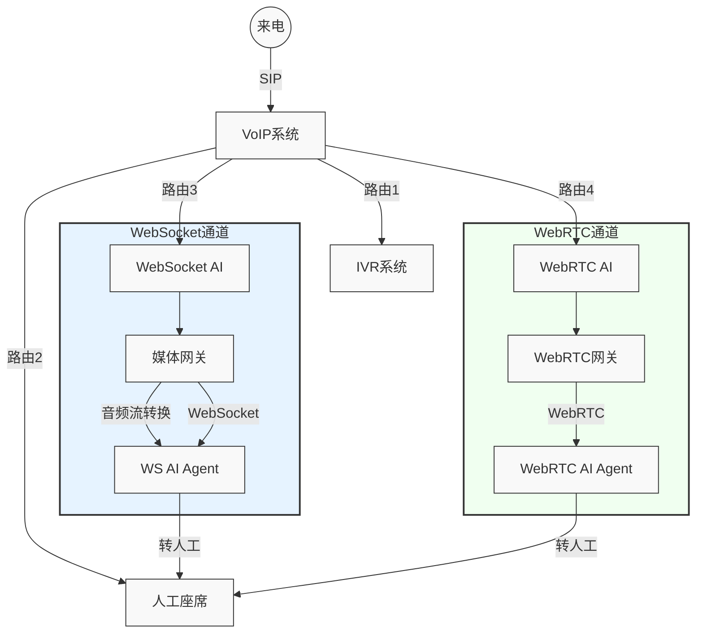
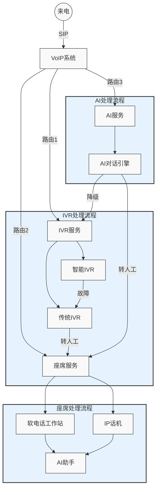

### 呼叫中心完整架构图

这个架构支持多种服务模式的无缝切换，并可以根据不同场景智能调度到相应的服务模块。


1. PSTN网络层:

	- 本地交换机(Local Exchange): 处理本地固定电话接入
	- 中继线路(Trunk Line): 连接PSTN网络与呼叫中心
	- E1网关: 处理E1数字中继接入
	- SS7信令网关: 处理SS7信令
	- PRI中继网关: 处理ISDN PRI接入

2. 运营商网络层:

	- 移动交换中心(MSC): 处理移动用户接入
	- 网关移动交换中心(GMSC): 连接移动网络与VoIP网络

3. 网关层细分:

	- TDM网关层: 处理传统电路交换网络接入
	- IP网关层: 
		-  SBC(Session Border Controller): 处理外部电话接入
		- WebRTC网关: 支持网页端实时通讯
		- SIP网关: 处理SIP协议通信
	
	  主要连接关系:
		1. 固定电话用户 -> 本地交换机 -> 中继线路 -> TDM网关(E1/SS7/PRI)
		2. 移动用户 -> MSC -> GMSC -> SBC
		3. 网页用户 -> WebRTC网关
		4. APP用户 -> SIP网关


4. 核心服务层

	1. 增加了SIP服务集群，包含：
	
		- 注册服务器(Registration Server)：处理终端注册
		- 代理服务器(Proxy Server)：处理SIP信令路由
		- 定位服务器(Location Server)：管理用户位置信息
	
	2. 重组了PBX系统集群，包括：
	
		- IP PBX系统：呼叫控制
		- 负载均衡器：流量分发
		- 呼叫队列管理
		- 智能路由系统
	
	3. 新增了媒体服务器集群，包含：
	
		- RTP媒体处理：处理实时音视频流
		- 编解码转换：处理不同编码格式转换
		- 会议混音：处理多方通话
	  
	主要连接关系：
	1. IP网关层 -> SIP服务集群 -> PBX系统集群/媒体服务器集群
	2. TDM网关层 -> PBX系统集群
	3. PBX系统集群 <-> 媒体服务器集群
	4. PBX系统集群 -> 人工座席/自动服务
	5. 媒体服务器集群 -> 自动服务（用于IVR、语音机器人等）
	6. 业务服务层
	SIP服务器作为核心组件承担了信令处理的职责，而媒体服务器则负责实际的音视频流处理。

5. 业务服务层

	- 人工座席服务:
	    - 座席工作站
	    - 座席主管
	    - 质检人员
	- 自动化服务:
	    - IVR (交互式语音应答)
	    - AI语音机器人
	    - AI文本机器人
	- 智能服务:
	    - NLP处理
	    - 语音识别
	    - 语音合成
	    - 知识库

6. 管理平台

	- 实时监控
	- 报表系统
	- 通话录音
	- 数据分析

7. 数据存储层

	- 业务数据库
	- Redis缓存
	- 文件存储

### 业务服务层

#### 人工坐席介绍

座席工作站主要功能：

- 人工交互界面
- 个性化服务处理
- 单人单线处理
- 工作时间服务
- 灵活的处理流程

座席工作站主要协议：
- HTTP/HTTPS：界面交互
- WebSocket：实时状态更新
- REST：业务操作
- WebRTC：语音通话
座席工作站集成特点：
```
PBX <-> 座席工作站 <-> 业务系统
   |         |
   |         -> 即时通讯
   -> CTI服务器 -> CRM系统
```





#### 传统IVR介绍

IVR系统功能包括：
- 自动化语音交互
- 标准化服务流程
- 大量并发处理
- 7×24小时运行
- 固定的业务流程

IVR主要协议：
- RTP：实时传输语音流
- MRCP：语音识别/合成控制
- SIP：呼叫控制

IVR的集成特点：
```
PBX <-> IVR <-> 业务系统
   |     |
   |     -> ASR/TTS
   -> 媒体服务器
```





#### 大模型加持的IVR升级

在传统IVR的基础上增加AI Agent的能力，包括大语音模型、知识库和Agent框架，完善IVR机器人的能力，开源框架包括：TEN-Agent




#### 智能Agent的实现

智能语音Agent支持WebSocket和WebRTC两种通信协议。OpenAI实时语音API属于WebSocket协议，LiveKit的实时语音API属于WebRTC协议。



#### 流程图

VoIP系统可以同时接入IVR和座席工作站，在引入AI Agent时可以有多种灵活的组合方式。


